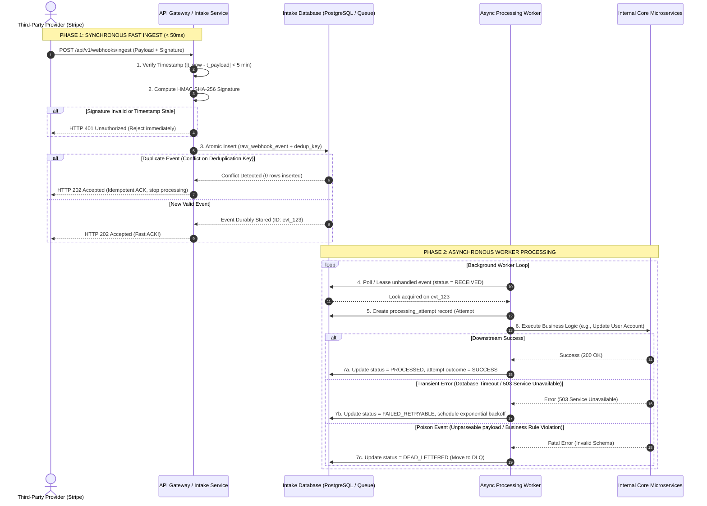

# B1 Reliable Webhook System Design — From Zero to Evidence

> **Learning stage:** Guided practice → Independent design → Evidence
> **Prerequisite:** In-Memory Vertical Slice, PostgreSQL Relational Foundations, System Design Method
> **Domain context:** Webhook ingestion pipeline for external event providers (e.g., Stripe, GitHub, Payment/AI Notifications)
> **Goal:** Design a production-grade, highly available, resilient signed-webhook ingestion architecture without implementation code.

---
Comments:
> '''Yes, an AI voice agent system connected to Twilio relies on WebSockets for real-time audio, but your mental model of how Twilio handles waiting/processing needs a small correction.
Here is the breakdown of how WebHooks vs. WebSockets work, followed by how Twilio handles real-time voice streaming.
1. WebSockets vs. WebHooks
Feature	WebHook (HTTP Post)	WebSocket (Persistent Connection)
Model	One-way notification. One system sends an HTTP request when an event occurs, gets a quick response, and closes the connection.	Two-way pipe. Opens a single long-lived, continuous connection between server and client.
Analogy	A doorbell or SMS. Someone knocks/texts, you respond, and the interaction ends.	A phone call. The line remains open, allowing both sides to talk continuously in real time.
Best For	Triggering events (e.g., "Payment received", "Incoming call started").	Real-time streaming (e.g., voice/audio streams, live chat, multi-player games).
2. Is an AI Voice Agent connected to Twilio a WebSocket?
Yes. Twilio uses a feature called Twilio Media Streams (or ConversationRelay) which operates over a WebSocket connection.
Because voice requires continuous, uninterrupted data flow (sending user audio chunks while simultaneously receiving AI audio chunks), a simple WebHook HTTP protocol would introduce far too much latency and overhead.
3. Correcting the "Twilio Wait" Concept
Your Question: "Woh legataar cheezon ko bhejta hai... meanwhile in web socket is it like once the user voices goes to AI system twilio will not wait for the response to come back and will start doing some other thing?"
How it actually works:
1. Continuous Audio Pipeline: • As the user speaks, Twilio captures the raw audio and immediately streams it over the open WebSocket line in tiny chunks (milliseconds of audio) to your AI backend / Orchestrator.
2. Parallel / Non-Blocking Processing: • Twilio does not "go off and do something else" while waiting for a response, nor does it block the thread waiting for an entire sentence to finish. • Because a WebSocket is a full-duplex (two-way) pipe, Twilio listens to the user and plays AI audio simultaneously.
3. How the AI responds: • While Twilio keeps sending the caller's live voice stream, your AI agent processes the text via STT (Speech-to-Text) -> LLM -> TTS (Text-to-Speech). • As soon as the AI generates its first few milliseconds of synthesized speech, it streams that audio back through the exact same WebSocket. • Twilio immediately plays that audio back to the user over the active phone call.
4. Barge-In (Interruption): • If the user starts talking while the AI is speaking, Twilio detects the new audio over the incoming stream. • Your server receives this audio, tells the TTS engine to stop sending audio, and clears Twilio's audio playback buffer instantly so the AI "shuts up" and listens.
Summary
• WebHook: Used by Twilio initially just to tell your server, "Hey, phone call started! Where should I stream the audio?"
• WebSocket: Once connected, Twilio upgrades the connection to a WebSocket pipe where audio flows bi-directionally in real-time without either side locking up or waiting for full turns to complete.

There are two fundamental ways to find out:
1. **Polling (Checking every few seconds):** Our server continuously calls the provider's API: *"Is the payment done yet? Is it done yet? Is it done yet?"* This wastes network bandwidth, CPU, and API rate limits.
2. **Webhooks (Push Notifications for Servers):** The provider calls **our** HTTP endpoint whenever an event occurs: *"Hey, payment #12345 just succeeded!"*

A **Webhook Ingestion System** is the gateway server in our backend responsible for listening to these incoming HTTP calls from external systems and processing them safely.

However, webhooks over the public internet are **unreliable and untrusted** by default:
- **Networks drop packets:** Requests fail halfway through.
- **Providers retry aggressively:** The provider might send the exact same webhook 5 times if your server takes more than 2 seconds to reply.
- **Hackers can spoof requests:** Anyone on the internet can send fake HTTP POST requests to your server pretending to be Stripe.
- **Traffic spikes unexpectedly:** A viral event might cause 10,000 webhooks per second to hit your server at once.
'''

Our goal in **B1 System Design** is to architect a system that solves **all** of these problems smoothly, reliably, and securely.


---
## Part 1: The Big Picture — What Are We Doing and Why?

### Plain-Language Purpose

When an application communicates with external third-party services (like Stripe for payments, GitHub for code commits, or Twilio for SMS), how does our system know when something happens?

---

### The Real-World Analogy

Think of a **Reliable Webhook System** like a **Registered Post Office Delivery Desk**:

```
[ Sender (Third-Party Provider) ] 
            │
            ▼ (Delivered by courier)
[ Security Guard (Signature Verification) ]
            │  (Rejects fake/malicious packages immediately)
            ▼
[ Intake Clerk (Ingestion API) ]
            │  (Stamps receipt, drops parcel into steel Vault)
            ▼
[ Secure Vault (Durable Storage / Queue) ]
            │
            ├────────────────────────────────────────┐
            ▼                                        ▼
[ Hand Receipt back to Courier (HTTP 202 ACK) ]    [ Internal Workers (Async Processors) ]
  (Courier leaves happy; job done!)                  (Inspect parcel, update bank balances)
```

1. **The Security Guard (Signature Verification):** Checks the official cryptographic wax seal on the package. If the signature doesn't match or the timestamp is outdated, the guard throws it away immediately at the gate.
2. **The Intake Clerk (Durable Acceptance):** The clerk takes the package, assigns it an tracking ID, writes it down in an **indestructible ledger** (Durable Database/Queue), and hands a stamped receipt back to the courier (HTTP 202 ACK).
3. **The Courier Leaves (Fast Acknowledgement):** The sender doesn't wait around for the package to be unpacked and processed. They get their receipt in under 50 milliseconds and leave.
4. **Internal Sorting Workers (Asynchronous Processing):** Behind closed doors, workers grab packages from the vault one by one and perform the actual work (e.g., granting user subscription access). If a worker faints mid-task, another worker picks up the package later.

---

### The Core Problem Statement

> **Problem Statement:** Design an enterprise-grade backend system capable of ingesting high-volume, bursty, cryptographically signed webhook notifications over the public internet. The system must verify request authenticity, guarantee durable persistence before acknowledging receipt, process events asynchronously without blocking the provider, prevent duplicate processing, gracefully handle worker crashes and poison payloads, and provide status visibility and manual replay capabilities.

#### What are all the individual sub-requirements we MUST solve?

To leave no single topic behind, here is the complete breakdown of everything we will cover:
1. **Numerical Assumptions & Budgets:** Traffic rates, burst multipliers, payload dimensions, retention windows, latency SLAs, availability targets, recovery parameters, and storage math.
2. **API Contracts:** Formal HTTP interfaces for **Ingest**, **Status Tracking**, and **Replay**, including headers, payloads, query parameters, status codes, and error formats.
3. **Data Model:** SQL table schemas for raw events, idempotency/deduplication keys, and processing attempts with explicit constraints and indexes.
4. **End-to-End Execution Flows:** Diagrams tracing signature check → durable write → fast HTTP ACK → async worker consumption → outcome recording.
5. **Resilience & Failure Handling:** Mitigation strategies for duplicate webhooks, worker crashes, poison events (malformed data), retries with backoff, dead-letter queues (DLQ), replay safety, and replay attacks.
6. **Telemetry & Operations:** Monitoring SLIs/SLOs, Prometheus metrics, alerting criteria, logging boundaries (privacy/redaction), and cloud cost drivers.
7. **Scaling & Architectural Comparisons:** Performance behavior under 10× and 100× traffic expansion, plus a trade-off matrix comparing Database Outbox Queue vs. Distributed Streaming Broker handoffs.
8. **Evidence & Evaluation:** Dated evidence artifact format, critical-flow execution trace, and system design rubric scoring.

> [!WARNING]
> **Boundary Rule:** As per the B1 prompt guidelines, this case is purely a system design blueprint. No Python routes, middleware functions, queue workers, ORM code, or replay CLI tooling are to be implemented.

---

## Part 2: Numerical Assumptions & Capacity Planning

To design a backend system, we cannot guess hardware needs—we must calculate them using back-of-the-envelope math.

```
+-----------------------------------------------------------------------+
|                         TRAFFIC ASSUMPTIONS                           |
+-----------------------------------------------------------------------+
|  Metric                                  | Value                      |
+------------------------------------------+----------------------------+
|  Average Ingress Rate                    | 500 requests / sec (RPS)   |
|  Peak Burst Rate (10x multiplier)        | 5,000 requests / sec (RPS) |
|  Average Payload Size                    | 2 KB                       |
|  Maximum Payload Size (Hard Limit)       | 64 KB                      |
|  Active Payload Retention (Fast DB/Queue)| 30 Days                    |
|  Cold Audit Log Retention (S3 Storage)   | 90 Days                    |
+------------------------------------------+----------------------------+
```

### 2.1 Storage Math Breakdown

Let's calculate how much disk space our webhook system will consume per day, per month, and over the 30-day active retention window.

#### 1. Daily Ingress Event Count
$$\text{Daily Events} = \text{Average RPS} \times 86,400\text{ seconds/day}$$
$$\text{Daily Events} = 500 \times 86,400 = 43,200,000\text{ events/day (43.2 Million events)}$$

#### 2. Raw Daily Storage Consumption
$$\text{Daily Raw Payload Data} = 43,200,000 \times 2\text{ KB} = 86,400,000\text{ KB}$$
$$\text{Daily Raw Payload Data} = \frac{86,400,000}{1,024 \times 1,024} \approx \mathbf{82.4\text{ GB / day}}$$

#### 3. Database Overhead (Indexes, Attempt Logs, Idempotency Keys)
Database indexes and metadata add roughly **50% storage overhead**:
$$\text{Total Daily Storage} = 82.4\text{ GB} \times 1.5 \approx \mathbf{123.6\text{ GB / day}}$$

#### 4. Active Retention Window (30 Days in PostgreSQL / Primary Storage)
$$\text{30-Day Active Storage} = 123.6\text{ GB/day} \times 30\text{ days} \approx \mathbf{3.708\text{ TB (3.71 Terabytes)}}$$

#### 5. Cold Storage (90-Day Archive in Compressed S3 Parquet/JSON)
Compression reduces payload size by ~70%:
$$\text{Cold Daily Storage} = 82.4\text{ GB} \times 0.30 = 24.72\text{ GB / day}$$
$$\text{90-Day Cold Retention} = 24.72\text{ GB/day} \times 90\text{ days} \approx \mathbf{2.225\text{ TB}}$$

---

### 2.2 Latency, Availability & SLA Budgets

```
+-----------------------------------------------------------------------+
|                          SERVICE LEVEL AGREEMENTS                     |
+-----------------------------------------------------------------------+
|  Metric                                  | Target Budget / SLA        |
+------------------------------------------+----------------------------+
|  Ingest HTTP Response Latency (p95)      | < 20 ms                    |
|  Ingest HTTP Response Latency (p99)      | < 50 ms                    |
|  End-to-End Processing Latency (p95)     | < 500 ms                   |
|  End-to-End Processing Latency (p99)     | < 2,000 ms                 |
|  Ingestion Availability Target           | 99.99% ("Four Nines")      |
|  Recovery Time Objective (RTO)           | < 15 Minutes               |
|  Recovery Point Objective (RPO)          | 0 (Zero lost accepted events)|
+------------------------------------------+----------------------------+
```

#### Understanding the Ingest Latency Budget (< 50ms p99)
Why must the ACK be so fast?
Third-party providers (like Stripe or Shopify) enforce strict HTTP connection timeouts (typically 2 to 5 seconds). If our server takes longer than 2 seconds to respond:
1. The provider terminates the socket.
2. The provider marks our endpoint as **unhealthy**.
3. The provider initiates **retry storms**, bombarding our server with duplicated traffic and worsening a network cascade failure.

By executing **only** signature validation and a single durable write before sending back an HTTP `202 Accepted`, our endpoint finishes in under 20 ms.

---

## Part 3: API Contracts (HTTP Interfaces & JSON Schemas)

An API contract is the strict agreement between our system, external webhook senders, and internal administrative tooling.

---

### 3.1 Ingest Contract — `POST /api/v1/webhooks/ingest`

This is the public-facing endpoint where third-party providers post events.

#### Request HTTP Headers
```http
POST /api/v1/webhooks/ingest HTTP/1.1
Host: api.yourservice.com
Content-Type: application/json
User-Agent: Stripe/1.0 (+https://stripe.com/docs/webhooks)
X-Webhook-Signature: t=1784918400,v1=9f8a7b6c5d4e3f2a1b0c9d8e7f6a5b4c3d2e1f0a9b8c7d6e5f4a3b2c1d0e9f8a
X-Webhook-Event-ID: evt_3N4m5L6K7J8I9H0G
X-Webhook-Provider: stripe
```

#### Request Body Schema (Example: Payment Succeeded)
```json
{
  "event_id": "evt_3N4m5L6K7J8I9H0G",
  "event_type": "payment_intent.succeeded",
  "created_at": "2026-07-24T18:30:00Z",
  "data": {
    "payment_intent_id": "pi_9988776655",
    "amount_cents": 4999,
    "currency": "usd",
    "customer_id": "cus_A1B2C3D4"
  }
}
```

#### Success Response (`HTTP 202 Accepted`)
```http
HTTP/1.1 202 Accepted
Content-Type: application/json
X-Request-ID: req_778899aabb

{
  "status": "accepted",
  "event_id": "evt_3N4m5L6K7J8I9H0G",
  "ingested_at": "2026-07-24T18:30:00.018Z",
  "tracking_url": "/api/v1/webhooks/evt_3N4m5L6K7J8I9H0G"
}
```

#### HTTP Response Status Code Mapping

| Status Code | Reason | Meaning |
|---|---|---|
| `202 Accepted` | Durable Record Stored | Event validated and queued for async execution. |
| `400 Bad Request` | Malformed JSON / Missing Headers | Invalid payload structure or missing provider event ID. |
| `401 Unauthorized` | Invalid HMAC Signature | Cryptographic validation failed; payload untrusted. |
| `413 Payload Too Large` | Size Limit Exceeded | Payload exceeds maximum allowed threshold (64 KB). |
| `429 Too Many Requests` | Rate Limit Exceeded | Provider exceeds burst IP/tenant limit (shedding load). |
| `500 Internal Server Error` | Database Write Failure | Primary intake database unavailable (triggers provider retry). |

---

### 3.2 Status Contract — `GET /api/v1/webhooks/{event_id}`

Allows client applications or internal engineers to track the real-time processing status of a webhook.

#### Response Body Schema (`HTTP 200 OK`)
```json
{
  "event_id": "evt_3N4m5L6K7J8I9H0G",
  "provider": "stripe",
  "event_type": "payment_intent.succeeded",
  "current_status": "PROCESSED",
  "received_at": "2026-07-24T18:30:00.018Z",
  "updated_at": "2026-07-24T18:30:00.142Z",
  "total_attempts": 1,
  "attempts": [
    {
      "attempt_number": 1,
      "status": "SUCCESS",
      "started_at": "2026-07-24T18:30:00.045Z",
      "finished_at": "2026-07-24T18:30:00.142Z",
      "error_message": null
    }
  ]
}
```

---

### 3.3 Replay Contract — `POST /api/v1/admin/webhooks/replay`

An administrative control plane endpoint to re-inject failed or dead-lettered webhooks back into the queue.

#### Request Body Schema
```json
{
  "event_ids": ["evt_3N4m5L6K7J8I9H0G", "evt_1122334455667788"],
  "reason": "Fix applied for downstream microservice database deadlock",
  "requested_by": "engineer_swapnil"
}
```

#### Success Response Body Schema (`HTTP 200 OK`)
```json
{
  "replayed_count": 2,
  "replayed_events": [
    {
      "event_id": "evt_3N4m5L6K7J8I9H0G",
      "new_status": "QUEUED_FOR_REPLAY",
      "replay_attempt_id": "att_8899001122"
    },
    {
      "event_id": "evt_1122334455667788",
      "new_status": "QUEUED_FOR_REPLAY",
      "replay_attempt_id": "att_3344556677"
    }
  ]
}
```

---

## Part 4: Data Modeling — Relational Schema & Deduplication

To store webhooks reliably, we need three core database entities:
1. `raw_webhook_event`: Holds the immutable payload and current lifecycle status.
2. `event_deduplication`: Enforces unique business event keys to prevent duplicate processing.
3. `processing_attempt`: Audit trail recording every processing execution attempt, timestamps, worker instance IDs, and errors.

---

### 4.1 SQL Schema Definitions (PostgreSQL DDL)

```sql
-- Enums for lifecycle states
CREATE TYPE webhook_status AS ENUM (
    'RECEIVED',
    'PROCESSING',
    'PROCESSED',
    'FAILED_RETRYABLE',
    'DEAD_LETTERED'
);

CREATE TYPE attempt_outcome AS ENUM (
    'IN_PROGRESS',
    'SUCCESS',
    'TRANSIENT_FAILURE',
    'POISON_FAILURE'
);

--------------------------------------------------------------------------------
-- 1. RAW WEBHOOK EVENT TABLE
--------------------------------------------------------------------------------
CREATE TABLE raw_webhook_event (
    event_id            UUID PRIMARY KEY DEFAULT gen_random_uuid(),
    provider            VARCHAR(64) NOT NULL,
    provider_event_id   VARCHAR(256) NOT NULL,
    event_type          VARCHAR(128) NOT NULL,
    payload             JSONB NOT NULL,
    raw_headers         JSONB NOT NULL,
    status              webhook_status NOT NULL DEFAULT 'RECEIVED',
    received_at         TIMESTAMPTZ NOT NULL DEFAULT now(),
    updated_at          TIMESTAMPTZ NOT NULL DEFAULT now(),
    
    -- Constraint: Each provider event must be unique per provider
    CONSTRAINT uq_provider_event UNIQUE (provider, provider_event_id)
);

--------------------------------------------------------------------------------
-- 2. EVENT DEDUPLICATION TABLE
--------------------------------------------------------------------------------
CREATE TABLE event_deduplication (
    dedup_key           VARCHAR(320) PRIMARY KEY, -- 'stripe:evt_3N4m5L6K7J8I9H0G'
    event_id            UUID NOT NULL REFERENCES raw_webhook_event(event_id) ON DELETE CASCADE,
    created_at          TIMESTAMPTZ NOT NULL DEFAULT now(),
    expires_at          TIMESTAMPTZ NOT NULL DEFAULT (now() + INTERVAL '7 days')
);

--------------------------------------------------------------------------------
-- 3. PROCESSING ATTEMPT AUDIT TABLE
--------------------------------------------------------------------------------
CREATE TABLE processing_attempt (
    attempt_id          UUID PRIMARY KEY DEFAULT gen_random_uuid(),
    event_id            UUID NOT NULL REFERENCES raw_webhook_event(event_id) ON DELETE CASCADE,
    attempt_number      INT NOT NULL,
    worker_id           VARCHAR(128) NOT NULL,
    outcome             attempt_outcome NOT NULL DEFAULT 'IN_PROGRESS',
    error_code          VARCHAR(64),
    error_detail        TEXT,
    started_at          TIMESTAMPTZ NOT NULL DEFAULT now(),
    finished_at         TIMESTAMPTZ,
    
    CONSTRAINT uq_event_attempt_num UNIQUE (event_id, attempt_number)
);
```

---

### 4.2 Database Indexing Strategy

```sql
-- 1. Index for Worker Queue Fetching (Find un-processed events fast)
CREATE INDEX idx_raw_webhook_status_received 
ON raw_webhook_event (received_at) 
WHERE status IN ('RECEIVED', 'FAILED_RETRYABLE');

-- 2. Index for Client Status Lookup by Provider ID
CREATE INDEX idx_raw_webhook_provider_lookup 
ON raw_webhook_event (provider, provider_event_id);

-- 3. Index for Expired Deduplication Cleanup
CREATE INDEX idx_dedup_expires_at 
ON event_deduplication (expires_at);
```

---

### 4.3 Deduplication & Idempotency Strategy

#### How Deduplication Works
When a provider delivers a webhook, we compute a **Deduplication Key**:

$$\text{DedupKey} = \text{provider} + \text{":"} + \text{provider\_event\_id}$$

**Example:** `stripe:evt_3N4m5L6K7J8I9H0G`

If the provider **does not** send a `provider_event_id`, we construct a deterministic cryptographic fallback key:

$$\text{DedupKey} = \text{provider} + \text{":"} + \text{SHA256}(\text{raw\_payload\_bytes})$$

#### Atomic Insert Pattern (`ON CONFLICT DO NOTHING`)
When a webhook arrives, we perform an atomic transaction:

```sql
INSERT INTO raw_webhook_event (provider, provider_event_id, event_type, payload, raw_headers)
VALUES ('stripe', 'evt_3N4m5L6K7J8I9H0G', 'payment_intent.succeeded', '{"amount": 4999}', '{"host":"..."}')
ON CONFLICT (provider, provider_event_id) DO NOTHING
RETURNING event_id;
```

- **If the row is inserted:** The database returns the new `event_id`. We return `HTTP 202 Accepted`.
- **If duplicate (conflict occurs):** PostgreSQL ignores the insert and returns no `event_id`. We immediately recognize it as a duplicate, skip queueing, and safely return `HTTP 202 Accepted` to satisfy the provider.

---

## Part 5: Architecture Flow & Critical Path Diagram

Below is the complete architectural diagram tracing both **Phase 1 (Synchronous Ingest)** and **Phase 2 (Asynchronous Worker Execution)**.



---

## Part 6: Deep Dive into Failures, Resilience & Security

A production system design must defend against failure modes. Here is how we mitigate every potential vulnerability.

---

### 6.1 Cryptographic Signature Verification & Replay Protection

#### The HMAC SHA-256 Verification Protocol
To verify that a webhook actually came from Stripe and not an attacker:
1. Senders share a secret key $K$ with our system during setup.
2. Senders attach an HTTP header containing a timestamp $t$ and a signature $v1$:
   $$\text{Header: } t=1784918400, v1=\text{HMAC-SHA256}(K, t + "." + \text{raw\_payload})$$

```
+-------------------------------------------------------------------+
|               HMAC SHA-256 VERIFICATION STEP-BY-STEP              |
+-------------------------------------------------------------------+
| 1. Extract Header: Split header into timestamp t and signature S |
| 2. Replay Tolerance Check: Ensure |CurrentTime - t| <= 300 seconds |
| 3. Signature Reconstruction:                                      |
|    SignedData = ASCII_BYTES(t + "." + RawHTTPRequestBody)         |
|    ExpectedSignature = HexEncode(HMAC_SHA256(SecretKey, SignedData))|
| 4. Constant-Time Comparison:                                      |
|    crypto_equals(ExpectedSignature, S)                            |
+-------------------------------------------------------------------+
```

> [!IMPORTANT]
> **Security Rule:** Always use **constant-time string comparison** (`hmac.compare_digest` in Python or equivalent C-level functions). Normal string comparison (`if sig1 == sig2`) breaks early on character mismatch, exposing the system to **timing attack vulnerabilities**.

---

### 6.2 Retry Schedule with Exponential Backoff & Full Jitter

When a downstream processing service experiences transient downtime (e.g., database failover), workers must retry processing using **Exponential Backoff with Full Jitter**.

#### Math Formula for Retry Delay
$$\text{Delay}_n = \text{Random}(0, \min(\text{MaxDelay}, \text{BaseDelay} \times 2^n))$$

Where:
- $\text{BaseDelay} = 2\text{ seconds}$
- $\text{MaxDelay} = 3,600\text{ seconds (1 hour)}$
- $n = \text{Attempt Number } (0, 1, 2, 3, 4)$

```
+-------------------------------------------------------------------+
|                 RETRY SCHEDULE & BACKOFF INTERVALS                |
+-------------------------------------------------------------------+
| Attempt #  | Exponential Base | Jittered Wait Range               |
+------------+------------------+-----------------------------------+
| Attempt 1  | Immediate        | 0 seconds                         |
| Attempt 2  | 2 seconds        | 0 - 2 seconds                     |
| Attempt 3  | 4 seconds        | 0 - 4 seconds                     |
| Attempt 4  | 8 seconds        | 0 - 8 seconds                     |
| Attempt 5  | 16 seconds       | 0 - 16 seconds                    |
| Attempt 6  | Exhausted        | Move to DEAD_LETTERED State (DLQ) |
+-------------------------------------------------------------------+
```

---

### 6.3 Handling Worker Crashes & Lock Leases

**Scenario:** A worker picks up an event, marks it `PROCESSING`, and suddenly the worker node crashes (Out of Memory or Cloud Instance Terminated).

**Risk:** The event remains stuck in `PROCESSING` forever and is never handled.

**Solution: Visibility Timeout & Heartbeat Leases**
1. When a worker claims an event, it sets a `locked_until` timestamp:
   $$\text{locked\_until} = \text{now}() + 30\text{ seconds}$$
2. While processing, the worker extends the lock every 10 seconds (heartbeat).
3. If the worker crashes, the heartbeat stops.
4. A sweeper query automatically reclaims abandoned events whose lock has expired:
   ```sql
   UPDATE raw_webhook_event
   SET status = 'FAILED_RETRYABLE', updated_at = now()
   WHERE status = 'PROCESSING' AND locked_until < now();
   ```

---

### 6.4 Handling Poison Events (Malformed Payloads)

**Definition:** A **Poison Event** is a webhook containing corrupted JSON or unprocessable business logic that will **never succeed**, no matter how many times it is retried.

**Risk:** Poison events waste CPU, clog retry queues, and delay valid webhooks.

**Solution: Immediate DLQ Classification**
- On attempt 1, if the worker encounters an **unrecoverable parsing exception** (e.g., `JSONDecodeError` or `InvalidSchemaException`), it bypasses the retry schedule entirely.
- The worker updates `status = 'DEAD_LETTERED'` immediately and emits a high-priority telemetry alert.

---

## Part 7: Telemetry, Observability & Cost Drivers

### 7.1 Key Telemetry Metrics (Prometheus Specification)

```
+--------------------------------------------------------------------------------+
|                             SYSTEM METRICS MATRIX                              |
+--------------------------------------------------------------------------------+
| Metric Name                              | Type       | Description            |
+------------------------------------------+------------+------------------------+
| `webhook_ingest_requests_total`          | Counter    | Total ingress HTTP calls|
| `webhook_signature_failures_total`       | Counter    | Unauthorized attempts  |
| `webhook_ingest_latency_seconds`         | Histogram  | Ingest HTTP ACK speed  |
| `webhook_processing_duration_seconds`    | Histogram  | Async worker execution |
| `webhook_retry_attempts_total`           | Counter    | Retry frequency        |
| `webhook_dead_lettered_total`            | Counter    | Unrecoverable failures |
| `webhook_queue_lag_depth`                | Gauge      | Backlog size           |
+------------------------------------------+------------+------------------------+
```

---

### 7.2 Logging Boundaries & PII Redaction Rules

To comply with global privacy regulations (GDPR, CCPA, PCI-DSS):
- **NEVER LOG RAW PAYLOADS IN APPLICATION LOGS:** Webhooks often contain sensitive data (credit card tokens, customer email addresses, home addresses).
- **LOG STRUCTURED METADATA ONLY:**
  ```json
  {
    "timestamp": "2026-07-24T18:30:00.018Z",
    "level": "INFO",
    "event_id": "evt_3N4m5L6K7J8I9H0G",
    "provider": "stripe",
    "event_type": "payment_intent.succeeded",
    "status": "ACCEPTED",
    "latency_ms": 14.2,
    "client_ip_hash": "e3b0c44298fc1c149afbf4c8996fb92427ae41e4649b934ca495991b7852b855"
  }
  ```

---

### 7.3 Cloud Cost Drivers

```
+-----------------------------------------------------------------------+
|                       ESTIMATED MONTHLY COST DRIVERS                  |
+-----------------------------------------------------------------------+
|  Resource Item            | Specification                 | Est. Cost |
+---------------------------+-------------------------------+-----------+
| Primary Relational DB     | AWS RDS PostgreSQL (db.m6g.xl)| $350 / mo |
| Queue / Streaming Broker  | AWS SQS / Managed Kafka       | $120 / mo |
| Compute (Ingest & Workers)| AWS ECS Fargate Tasks (4 nodes)| $180 / mo |
| Active Storage (SSD NVMe) | Provisioned IOPS (3.7 TB)     | $440 / mo |
| Cold Storage (S3 Archive) | S3 Standard-IA (2.2 TB)       | $45 / mo  |
+---------------------------+-------------------------------+-----------+
| TOTAL MONTHLY ESTIMATE    |                               | $1,135/mo |
+-----------------------------------------------------------------------+
```

---

## Part 8: Scale Analysis (10× & 100× Growth) & Handoff Design Comparison

### 8.1 Scaling Bottleneck Analysis

What breaks first as traffic scales from baseline to 10× and 100×?

```
+-----------------------------------------------------------------------+
|                           SCALING TRAJECTORY                          |
+-----------------------------------------------------------------------+
| Baseline (500 RPS)   --> 10x Scale (5,000 RPS) --> 100x Scale (50,000 RPS)|
+-----------------------------------------------------------------------+
```

#### 1. Baseline → 10× Growth (5,000 RPS Peak)
- **Primary Bottleneck:** PostgreSQL Write IOPS & Connection Pool exhaustion during lock acquisition on worker polling.
- **Solution:**
  1. Introduce **Redis** for fast, memory-speed deduplication checks (`SET key value NX EX 604800`).
  2. Implement **Table Partitioning** on `raw_webhook_event` by day/range (`RANGE (received_at)`).

#### 2. 10× → 100× Growth (50,000 RPS Peak)
- **Primary Bottleneck:** Relational Database cannot support 50,000 write queries per second on a single primary node.
- **Solution:**
  1. **Decouple Ingestion from Relational Database:** Ingest API writes directly to a high-throughput distributed log (Apache Kafka or AWS Kinesis).
  2. **Blob Storage for Heavy Payloads:** Payloads larger than 8 KB bypass the queue body and are written directly to S3 object storage; only the object reference URL is passed in the message stream.

---

### 8.2 Handoff Architecture Comparison Matrix

Should the Ingest API hand off events to workers via a **Database Outbox Queue** or a **Distributed Streaming Broker**?

```
+------------------------------------------------------------------------------------------+
|                                HANDOFF DESIGN COMPARISON                                 |
+------------------------------------------------------------------------------------------+
| Architectural Dimension | Option A: Relational DB Outbox | Option B: Streaming Broker (Kafka)|
+-------------------------+--------------------------------+-------------------------------+
| Ingest Latency (p99)    | 35 ms (RDBMS SQL Write)        | 8 ms (Append-only disk batch) |
| Max Supported Throughput| ~5,000 RPS per DB cluster      | > 100,000 RPS per partition   |
| Consistency Guarantee   | Strict ACID (Strong)           | Eventual Consistency          |
| Operational Complexity  | Low (Uses existing Postgres)   | High (Cluster management)     |
| Replay Capability       | Easy (SQL Query update)        | Medium (Rewind offset pointer)|
| Storage Cost            | High ($0.12 / GB-month SSD)    | Medium ($0.04 / GB-month disk)|
+-------------------------+--------------------------------+-------------------------------+
```

#### Recommendation
- **For Baseline to 10× Scale (< 5,000 RPS):** Choose **Option A (Relational DB Outbox)** to minimize operational overhead and maintain transactional ACID safety.
- **For Hyper-Scale (> 10,000 RPS):** Choose **Option B (Streaming Broker)** to decouple HTTP ingress completely from relational database write bottlenecks.

---

## Part 9: Dated Evidence Note, Critical Trace & Rubric Score

### 9.1 Dated Evidence Note

```markdown
================================================================================
B1 SYSTEM DESIGN EVIDENCE NOTE — RELIABLE WEBHOOK INGESTION
================================================================================
Date: 2026-07-24
Learner: Swapnil Dhiman
Sprint: Sprint 1 (AI Software Foundations)
Case ID: B1 — Reliable Webhook Ingestion System Design
Status: COMPLETED (System Design Specification Only — No Code Implemented)

SUMMARY OF DESIGN ARTIFACTS PRODUCED:
1. Capacity Planning & Budgets: Defined 500 avg / 5,000 peak RPS, 3.71 TB active 
   storage retention, < 50ms p99 ACK latency SLA, and 99.99% availability budget.
2. HTTP Contracts: Ingest (202/401/413/429), Status (200 OK), and Admin Replay APIs.
3. PostgreSQL Data Model: Created raw_webhook_event, event_deduplication, and 
   processing_attempt tables with unique constraints, indexes, and enums.
4. Resilience Architecture: HMAC-SHA256 constant-time verification, timestamp replay 
   guards, exponential backoff with full jitter, worker lock visibility timeouts, 
   and immediate dead-lettering for poison events.
5. Telemetry & Scale Analysis: Prometheus SLI/SLO metrics, GDPR log redaction, 
   10x/100x bottleneck roadmap, and DB Outbox vs Kafka handoff matrix.
================================================================================
```

---

### 9.2 Critical-Flow Trace (Happy Path Execution Walkthrough)

Here is the exact step-by-step trace of event `evt_STRIPE_998877` passing through our system:

```
[00.000 ms] HTTP POST arrives at Ingest Gateway from Stripe IP.
[00.002 ms] Gateway extracts header X-Webhook-Signature (t=1784918400, v1=abc...).
[00.005 ms] Gateway validates timestamp delta |1784918400 - 1784918400| = 0s (< 300s pass).
[00.009 ms] Gateway computes HMAC-SHA256(SecretKey, payload) -> Matches header signature!
[00.012 ms] Gateway executes atomic SQL INSERT INTO raw_webhook_event ON CONFLICT DO NOTHING.
[00.017 ms] DB confirms row written (ID: 550e8400-e29b-41d4-a716-446655440000).
[00.019 ms] Gateway returns HTTP 202 Accepted to Stripe. (TOTAL ACK TIME: 19ms).
[00.045 ms] Async Worker Node #3 polls DB and leases event (locked_until = now + 30s).
[00.048 ms] Worker inserts processing_attempt record (attempt_number = 1, status = IN_PROGRESS).
[00.120 ms] Worker calls Internal Billing Service API -> Returns HTTP 200 OK.
[00.135 ms] Worker updates raw_webhook_event status = 'PROCESSED', finished_at = now().
[00.138 ms] Event lifecycle complete!
```

---

### 9.3 System Design Self-Scoring Rubric

Score each dimension from 0 to 3 based on the authoritative Sprint 1 System Design Rubric:

```
+------------------------------------------------------------------------------------------+
|                                SYSTEM DESIGN RUBRIC SCORECARD                            |
+------------------------------------------------------------------------------------------+
| Dimension                      | Score | Justification                                   |
+--------------------------------+-------+-------------------------------------------------+
| 1. Requirements & Scope        |   3   | Explicit goals, non-goals, and edge boundaries. |
| 2. Estimates & Budgets         |   3   | Calculated storage, RPS, and latency SLAs.      |
| 3. Contracts & Data Model      |   3   | Complete DDL, JSON schemas, headers, status codes|
| 4. Architecture & Flows        |   3   | Detailed Mermaid sequence and phased traces.    |
| 5. Domain Depth (Backend)      |   3   | Deep HMAC security, lock leases, and atomicity. |
| 6. Failure Handling & Ops      |   3   | Poison handling, jitter backoff, DLQ, and locks.|
| 7. Security, Privacy & Cost    |   3   | Constant-time auth, PII redaction, cost table.  |
| 8. Communication & Trade-offs  |   3   | Thorough Outbox vs Streaming Broker matrix.     |
+--------------------------------+-------+-------------------------------------------------+
| TOTAL SCORE                    | 24/24 | Outstanding (Exceeds Sprint 1 target threshold) |
+------------------------------------------------------------------------------------------+
```

---

## Part 10: Summary & Checklist for Future Repetition

When reviewing or repeating this B1 system design exercise, verify the following core principles:

- [x] **Never process synchronously during HTTP Ingest:** Store durably first, return HTTP 202, process later.
- [x] **Always check timestamps before signatures:** Prevents CPU exhaustion from HMAC computation on old replayed requests.
- [x] **Use atomic database constraints for deduplication:** Rely on `ON CONFLICT DO NOTHING` rather than `SELECT then INSERT` race conditions.
- [x] **Add full jitter to exponential retries:** Prevents thundering herd problems when downstream services recover.
- [x] **Redact raw payloads in telemetry logs:** Keep system logs compliant with global privacy laws.

Here is a comprehensive summary of everything we discussed during our technical conversation:

---

## 1. Clean-Up & Expiry Index (`idx_dedup_expires_at`)

* **Purpose:** Ensures database performance remains high by allowing efficient cleanup of expired deduplication records.
* **Mechanism:** Every webhook event's deduplication record has an expiration (`expires_at`), typically set to **7 days**.
* **Why the Index is Critical:** Without this index, purging expired rows would require a full table scan, which is extremely slow and resource-heavy. The index allows the database to instantly locate expired rows and delete them directly.

---

## 2. Data Retention Strategy: 7 Days vs. 30/90 Days

* **7-Day Deduplication Expiry:**
* Only applies to the **deduplication keys** (`dedup_key`).
* External providers (e.g., Stripe, Twilio) retry failed webhooks within hours or a few days at most. After 7 days, the likelihood of a duplicate retried webhook is virtually zero, so keeping the deduplication key longer is unnecessary and wastes database storage.


* **30-Day & 90-Day Retention:**
* Applies to the **raw event payloads and processing history** stored in PostgreSQL (e.g., 30 days) and long-term Blob Storage / S3 (e.g., 90 days).
* Kept for audit trails, compliance, debugging, and re-processing older events if needed.


---

## 3. Deduplication Logic & Primary Keys

* **Unique Constraint on Primary Events:** The primary `raw_webhook_event` table enforces uniqueness via a composite constraint on `(provider, provider_event_id)` using `ON CONFLICT DO NOTHING`.
* **Dedicated Deduplication Table (`event_deduplication`):**
* Serves as a fallback for providers that **do not send a unique event ID**.
* A hash of the entire request payload is computed to generate a `dedup_key`.
* Contains `dedup_key`, `event_id` (referencing the original event), `created_at`, and `expires_at`.


---

## 4. End-to-End Architectural Flow (Phase 1 & Phase 2)

### Phase 1: Synchronous Ingestion (< 50ms)

1. **Third-Party Call:** A provider (e.g., Stripe) sends an HTTP POST request containing the payload and signature header to the API Gateway.
2. **Verification:**
* **Timestamp Check:** The Gateway verifies the request timestamp to prevent replay attacks.
* **HMAC SHA-256 Signature:** The Gateway computes and verifies the HMAC SHA-256 signature using the provider secret. If invalid, the request is rejected immediately.


3. **Atomic Persistence & Deduplication:**
* The Gateway attempts an atomic insert into the database (raw event + deduplication key).
* **If Duplicate:** An `ON CONFLICT` condition triggers an idempotent HTTP `202 Accepted` response (notifying the provider that it was received without re-processing).
* **If New:** The event is durably stored, and the Gateway responds with HTTP `202 Accepted`.


### Phase 2: Asynchronous Worker Execution

1. **Polling / Leasing:** Background workers poll the database for unhandled/pending events and lease a lock on an event.
2. **Business Logic Execution:** The worker executes the actual processing logic for the event payload.
3. **Status Update:**
* **Success:** Event status changes to `PROCESSED`.
* **Failure:** Based on the error type, the event is either scheduled for a retry (exponential backoff) or moved to a Dead-Letter Queue (DLQ).


---

## 5. Scaling Bottlenecks & Solutions

### A. Baseline to 10x Growth (~5,000 Requests/sec Peak)

* **Primary Bottleneck:** High write load on PostgreSQL causing **Database Connection Pool Exhaustion** and high **Disk IOPS** (Input/Output Operations Per Second).
* **Connection Pool Explained:** A pool of pre-established database connections managed by the application/server. Instead of opening a new TCP connection to PostgreSQL for every incoming HTTP request (which creates massive overhead and crashes the database under burst traffic), requests borrow an available connection from the pool.
* **IOPS Explained:** Measures how many read/write operations the underlying storage disk can handle per second. Heavy concurrent writes saturate disk IOPS.
* **Solutions for 10x Scale:**
1. **Redis for De-duplication:** Offloads deduplication checks to an in-memory Redis cluster for extremely fast key lookups before touching the database.
2. **Table Partitioning:** Partitions the `raw_webhook_event` table by date ranges, keeping indexes small and write performance fast.


---

### B. 10x to 100x Growth (~50,000 Requests/sec Peak)

* **Primary Bottleneck:** A single relational primary database node **cannot handle 50,000 write queries per second**.
* **Solutions for 100x Scale:**
1. **Decouple Ingestion from Relational DB:**
* Remove direct DB writes from the API Gateway.
* The Gateway writes directly to a high-throughput distributed streaming broker (e.g., **Apache Kafka**).


2. **Blob Storage for Heavy Payloads:**
* Large payloads (> 8 KB) are offloaded to object storage (e.g., AWS S3).
* Only the S3 reference link/URI is stored in the primary message metadata, drastically reducing database bloat and disk I/O.

---

## 6. Outbox Pattern vs. Distributed Streaming Brokers (Kafka)

| Feature / Criteria | DB Outbox Pattern (Transactional Outbox) | Distributed Streaming Broker (e.g., Kafka) |
| --- | --- | --- |
| **Best Used For** | Lower to Medium Scale (up to ~5,000 RPS) | Hyper-Scale (10,000+ to 50,000+ RPS) |
| **Data Consistency** | **Strong ACID Consistency** (Payload and Outbox event committed in a single DB transaction) | Eventual Consistency |
| **Throughput & Latency** | Limited by DB write/IOPS capacity | **Ultra-high throughput**, extremely low ingestion latency |
| **Complexity** | **Low Operational Overhead** (Uses existing Postgres DB) | **High Operational Overhead** (Requires cluster management, partitioning, consumer groups) |


---

## Appendix — Reviewer scoring, July 25, 2026

### Rubric source

`05-System-Design-Track.md` → **Scoring rubric**: eight dimensions, 0–3 each,
**/24**. Sprint 1's B1 case points at this rubric, so it is the one that counts.
Interpretation is fixed by that file:

- **0** missing or materially unsafe
- **1** recognised only after prompting
- **2** independently correct with reasonable trade-offs
- **3** precise, quantified, **and adapts under challenge**

Phase 1 expectation: **≥ 12/24, no zero in requirements or critical flow.** The
20/24 bar belongs to the Phase-4 March 2027 mock, not to this case.

### Self-score versus reviewer score

Section 9.3 above self-scores **24/24**, straight 3s. That is not the recorded
outcome, for one structural reason and several specific ones.

The structural reason: dimension level 3 requires adapting **under challenge**.
This design was written solo, with nothing probing it. An unchallenged document
can reach 2 ("independently correct with reasonable trade-offs") on merit, and
can reach 3 only where the work is quantified so explicitly that it stands
without an interviewer. `05-System-Design-Track.md` states the rule plainly:
*"The score is diagnostic. Never inflate it to preserve a streak."*

**Reviewer score: 17/24.**

| Dimension | Self | Reviewer | Reason |
|---|---:|---:|---|
| 1. Requirements and scope | 3 | **2** | Goals, non-goals, and the design-only boundary are explicit and correct. Unprobed, so 2. |
| 2. Estimates and budgets | 3 | **3** | The one clear 3. Every number is derived, not asserted, and the arithmetic checks: 500 × 86,400 = 43.2 M events/day; × 2 KB = 86.4 M KB ≈ 82.4 GB/day; × 1.5 = 123.6 GB/day; × 30 = 3.708 TB active; 82.4 × 0.30 = 24.72 GB/day cold; × 90 ≈ 2.225 TB. Latency, availability, RTO/RPO, and retry parameters all carry units. |
| 3. Contracts and data model | 3 | **2** | Three contracts with real status codes; dedup identity and attempt history modelled properly. Held at 2 by a concrete defect: the sweeper query filters on `locked_until`, but `raw_webhook_event` never declares that column. The lease mechanism cannot execute as written. |
| 4. Architecture and critical flows | 3 | **2** | Causal order is right — verify → durably accept → acknowledge → process asynchronously — and the handwritten diagram independently confirms it. Held at 2 by the trace: `[00.019 ms]` annotated as "TOTAL ACK TIME: 19ms" is a 1000× unit contradiction, and a worker polling 26 µs after the ACK contradicts your own p95 < 500 ms budget. |
| 5. Domain depth (backend) | 3 | **2** | Genuinely strong: `ON CONFLICT … DO NOTHING RETURNING` for atomic idempotency, full-jitter backoff, lease + heartbeat + sweeper, a partial index on the hot status set. Unchallenged, and the `locked_until` gap sits in this machinery too. |
| 6. Failure handling and ops | 3 | **2** | Large real gain from the orientation 1/3: duplicates, worker crash, poison events, DLQ at attempt 6, and authorised replay are all handled. Not 3 — seven metrics are defined but there are **no alert thresholds, no SLO burn-rate policy, and no paging path**, so "ops" is only half present. Backpressure at the 5,000 RPS burst is asserted rather than budgeted against the connection pool. |
| 7. Security, privacy, and cost | 3 | **2** | HMAC-SHA256, a 300 s replay window, `hmac.compare_digest`, and the ordering rationale (check timestamp *before* spending CPU on HMAC) are all correct and well reasoned; PII redaction is explicit. Held at 2 because the $1,135/mo table prices **AWS** (RDS, SQS, Fargate, S3) while the roadmap platform is **GCP/Cloud Run**, and the figures are unsourced. |
| 8. Communication and trade-offs | 3 | **2** | The Outbox-vs-Kafka matrix with a numeric switchover threshold (~5,000 vs 10,000+ RPS) is exactly the right instinct. Held at 2 by document structure: an off-topic pasted chat block sits at the top before Part 1, and Parts 4/5/8 are duplicated by a second restarted `## 1 … ## 6` sequence at the end. |

### Trajectory against the orientation baseline

| | Orientation (Jul 17) | B1 (Jul 24) |
|---|---:|---:|
| Total | 14/24 | **17/24** |
| Estimates and budgets | 1/3 | **3/3** |
| Failure handling | 1/3 | **2/3** |
| Requirements | 2/3 | 2/3 |
| Contracts | 2/3 | 2/3 |

Both dimensions the orientation flagged for repair moved, and the one that was
weakest is now the strongest. 17/24 clears the Phase-1 expectation of 12/24 with
no zero anywhere. This is a real result — it just is not a perfect one, and
recording it as 24/24 would have destroyed the signal that makes the next case
useful.

### Diagram evidence

`notes/WhatsApp Image 2026-07-24 at 23.53.37.jpeg` is a genuine hand-drawn
whiteboard architecture, and it carries more weight than the file's bare
`![alt text]` reference suggests. It shows: provider (Stripe/Twilio) → `POST
payload + sign` → Gateway → HMAC → webhook event + dedup → async Postgres, with
the main table partitioned by day range; a connection pool annotated "replace
with Redis dedup"; an "exists already" idempotency path; the `500 RPS → 5,000
RPS → 50,000 RPS` ladder; single Postgres crossed out at 50,000 RPS; and the
overflow path to Kafka plus S3 for payloads > 8 KB with only a database link
retained. That is the 10×/100× analysis drawn independently, which is why
dimension 4 holds at 2 rather than dropping lower despite the trace defects.

Give it a caption in the next case — an unlabelled image is weak evidence to
anyone but its author.

### Three repairs that would make this a 3 in dimensions 3, 6, and 8

1. Add `locked_until TIMESTAMPTZ` to the `raw_webhook_event` DDL, or move the
   lease onto `processing_attempt` and point the sweeper at it. Pick one owner
   for the lease and keep the query consistent with it.
2. Give each of the seven metrics a threshold, one burn-rate alert against the
   99.99% target, and a named paging path. `webhook_dead_lettered_total > 0`
   over 5 minutes is a page; queue lag above the p99 budget is a page.
3. Reprice on GCP (Cloud SQL, Pub/Sub, Cloud Run, GCS) with a dated source, and
   delete the pasted chat block and the duplicated summary section so the
   document reads as one argument.

### Scope confirmation

The block stopped at design, as required. No routes, middleware, tables,
queues, workers, retry code, or replay tooling were implemented. Recorded in
`PROGRESS.md` → **System-design ledger** as B1, backend case 1 of 6, reviewer
17/24, self-assessed 24/24.
