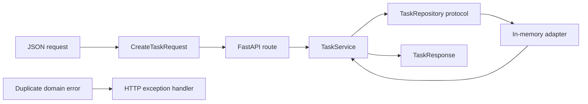

# Sprint 01 — AI Software Foundations

> Dates: Monday, July 20–Sunday, August 2, 2026  
> Required roadmap time: approximately 24–25 hours per week  
> Build outcome: tested FastAPI/Postgres foundation with safe async and webhook
> behavior

## In plain language

Before adding a model, build the reliable shell that will contain it. This
sprint proves that requests are validated, business logic is separated from
HTTP, concurrent work is bounded, data changes are transactional, duplicate
events are safe, and tests can catch failures.

The sprint intentionally contains no real agent framework.

## Sprint 1 learning contract

Sprint 1 is the first production-AI backend sprint. Its listed outputs are
end-of-sprint competencies, not prerequisites the learner is assumed to have.
Each generated daily plan, and each dated session newly authored or materially
revised after evidence, must identify Learn, Guided practice, Independent build,
or Evidence and must start from the latest demonstrated artifact. This recovery
does not claim untouched Sprint 1 sessions already carry that metadata; they
retain their existing format until intentionally revised.

- Python/FastAPI starts with transport boundaries, validation, dependency
  injection, and HTTP contracts before production lifecycle depth.
- The Apple lane assumes general iOS/Swift experience but does not assume
  independent SwiftUI observation/state architecture. It progresses from state
  model and fake service to observable feature, view, actor integration, and
  tests across separate Apple blocks.
- A guided checkpoint can be complete while the sprint outcome remains partial.
  Record the demonstrated stage; never turn unproven mastery into same-day backlog.

## Prerequisites

- Orientation results recorded.
- Python 3.12+, `uv`, Git, and a working editor.
- Docker/Postgres available by the second week.
- Current Xcode/Swift toolchain recorded.
- Primary DSA language selected or explicitly pending.

If Python typing, async, or HTTP diagnostic scored 0, replace the first matching
build block with the isolated exercise. Do not remove the exit gate.

## Concepts to be able to explain

- domain model versus transport/database model;
- dependency inversion and structural typing with `Protocol`;
- event loop, task, cancellation, timeout, semaphore, and backpressure;
- sync versus async work;
- HTTP method, status, validation, idempotency, and error contract;
- transaction, isolation, unique constraint, index, migration, and rollback;
- unit versus integration versus contract test;
- webhook signing, fast acknowledgement, duplicate delivery, and retries;
- process lifecycle, health, readiness, and graceful shutdown.

## Target repository shape

```text
ai-solutions-platform/
├── pyproject.toml
├── uv.lock
├── .env.example
├── src/ai_solutions_platform/
│   ├── domain/
│   ├── application/
│   ├── api/
│   ├── persistence/
│   ├── integrations/
│   └── telemetry/
├── tests/
│   ├── unit/
│   ├── integration/
│   └── contract/
├── migrations/
├── docs/decisions/
├── compose.yaml
└── .github/workflows/ci.yml
```

The exact number of files is not assessed. Dependency direction is.

## Simple runnable exercise

This exercise shows the boundary before adding Postgres. It is deliberately
small enough to run independently.

### Setup

```bash
mkdir sprint-01-api && cd sprint-01-api
uv init --python 3.12
uv add fastapi uvicorn
uv add --dev pytest httpx
```

Create `app.py`:

```python
"""A small FastAPI service with domain/HTTP separation.

Run:
    uv run uvicorn app:app --reload
Test:
    uv run pytest -q
"""

import asyncio
from dataclasses import dataclass
from datetime import UTC, datetime
from typing import Protocol
from uuid import UUID, uuid4

from fastapi import FastAPI, Request, status
from fastapi.responses import JSONResponse
from pydantic import BaseModel, Field


# Domain object: it has no FastAPI or Pydantic dependency.
@dataclass(frozen=True)
class TaskRecord:
    task_id: UUID
    title: str
    created_at: datetime


class DuplicateTaskTitle(Exception):
    """Business error raised independently from HTTP."""


class TaskRepository(Protocol):
    """Application-facing persistence contract."""

    async def add(self, record: TaskRecord) -> None:
        ...


class InMemoryTaskRepository:
    """A test/demo adapter. Postgres replaces it later."""

    def __init__(self) -> None:
        self._records_by_title: dict[str, TaskRecord] = {}
        # The lock protects the read-then-write critical section.
        self._lock = asyncio.Lock()

    async def add(self, record: TaskRecord) -> None:
        async with self._lock:
            if record.title in self._records_by_title:
                raise DuplicateTaskTitle(record.title)
            self._records_by_title[record.title] = record


class TaskService:
    """Application logic depends on the protocol, not a database SDK."""

    def __init__(self, repository: TaskRepository) -> None:
        self._repository = repository

    async def create(self, title: str) -> TaskRecord:
        record = TaskRecord(
            task_id=uuid4(),
            title=title,
            created_at=datetime.now(UTC),
        )
        await self._repository.add(record)
        return record


# HTTP models are separate because external contracts evolve differently.
class CreateTaskRequest(BaseModel):
    title: str = Field(min_length=1, max_length=120)


class TaskResponse(BaseModel):
    task_id: UUID
    title: str
    created_at: datetime


app = FastAPI(title="Sprint 01 API")
repository = InMemoryTaskRepository()
service = TaskService(repository)


@app.exception_handler(DuplicateTaskTitle)
async def duplicate_task_handler(
    request: Request,
    error: DuplicateTaskTitle,
) -> JSONResponse:
    del request, error  # The response intentionally exposes no internal detail.
    return JSONResponse(
        status_code=status.HTTP_409_CONFLICT,
        content={
            "code": "duplicate_task_title",
            "message": "A task with this title already exists.",
        },
    )


@app.get("/health")
async def health() -> dict[str, str]:
    # Liveness proves the process responds; readiness is added with Postgres.
    return {"status": "ok"}


@app.post(
    "/tasks",
    response_model=TaskResponse,
    status_code=status.HTTP_201_CREATED,
)
async def create_task(body: CreateTaskRequest) -> TaskResponse:
    record = await service.create(body.title)
    return TaskResponse(
        task_id=record.task_id,
        title=record.title,
        created_at=record.created_at,
    )
```

Create `test_app.py`:

```python
from fastapi.testclient import TestClient

from app import app


client = TestClient(app)


def test_create_and_reject_duplicate() -> None:
    title = "unique-title-for-this-test"

    created = client.post("/tasks", json={"title": title})
    assert created.status_code == 201
    assert created.json()["title"] == title

    duplicate = client.post("/tasks", json={"title": title})
    assert duplicate.status_code == 409
    assert duplicate.json()["code"] == "duplicate_task_title"


def test_validation_is_an_http_contract() -> None:
    response = client.post("/tasks", json={"title": ""})
    assert response.status_code == 422
```

Run:

```bash
uv run pytest -q
uv run uvicorn app:app
```

### How the exercise works



The route translates HTTP into an application call. The service owns the use
case. The repository protocol lets Postgres replace the in-memory adapter
without changing the service. A domain error is translated at the edge rather
than teaching the domain about HTTP status codes.

### Extend the exercise

Before moving on:

- make title comparison case-insensitive without changing the HTTP layer;
- write a concurrent duplicate test;
- add a read operation;
- replace the global dependencies with FastAPI dependency providers;
- explain why the lock is insufficient across multiple processes;
- identify which database constraint must enforce the invariant in production.

## Week 1 — language, async, API, and SQL

### Monday, July 20

#### 2:15–4:15 — Python domain boundaries

- Dataclasses, immutability, enums, protocols, generics, exceptions, and type
  narrowing.
- Implement the isolated service above without copying.
- Add Ruff and mypy/pyright to the platform repository.

#### 4:30–6:30 — repository skeleton and CI

- Initialize `src/` layout and `uv` lockfile.
- Add formatting, lint, type, and test commands.
- Create the first architecture decision:
  “Domain code cannot import model, web, or database SDKs.”
- Add a minimal GitHub Actions workflow.

#### 9:30–10:30 — DSA

Arrays/hash maps: one due/revision problem.

### Tuesday, July 21

#### 2:15–4:15 — safe async

- Event-loop model, coroutine versus task, task groups, cancellation, timeout,
  semaphore, and blocking boundaries.
- Compare bounded and unbounded fake dependency calls.
- Write tests for timeout and cancellation cleanup.
- Orientation adjustment (learning): demonstrate the blocking boundary directly - stall the loop with time.sleep inside one coroutine, show it starves concurrent tasks, then fix with asyncio.sleep / run_in_executor; state which call blocks the event loop and why (closes the async diagnostic's inverted blocking-vs-non-blocking explanation).

#### 4:30–6:30 — Swift Concurrency

- Rebuild the orientation actor example in a Swift package.
- Add task cancellation and one Swift Testing test.
- Identify `MainActor` UI boundaries.

#### 9:30–10:30 — DSA

One unseen arrays/hash-maps problem.

### Wednesday, July 22

#### 2:15–4:15 — FastAPI flow

- Request/response validation, dependency injection, middleware, lifespan, and
  error mapping.
- Implement health, readiness placeholder, create, and read routes.
- Generate and inspect OpenAPI.

#### 4:30–6:00 — DSA

Two pointers: one pattern exercise and one timed problem.

#### 6:00–8:00 — IIT KGP

Move the remaining DSA 30 minutes to Sunday.

### Thursday, July 23

#### 2:15–4:15 — FastAPI flow + API-contract evidence (Learn → Guided practice → Independent build → Evidence)

- **Assumed prerequisite:** the verified domain service/repository checkpoint; no
  prior FastAPI dependency-lifetime or OpenAPI-contract mastery is assumed.

- **Focused sources:** the existing domain/application files, FastAPI Dependencies,
  Additional Responses in OpenAPI, Async Tests, and Pydantic Models from the
  official resources below.
- **Learn (20 minutes):** distinguish ASGI server, FastAPI app, route, Pydantic
  transport schema, application service, repository protocol, and persistence
  adapter. Exit by explaining the request path without framework jargon.
- **Guided practice (55 minutes):** implement request/response validation, per-app
  dependency composition, health, readiness placeholder, create, and read routes.
  Exit when two app factories demonstrably own separate repositories.
- **Independent build (20 minutes):** map duplicate and missing-task outcomes to
  stable HTTP contracts without importing FastAPI into the core. Exit with the
  route-level mappings and a zero-match forbidden-import scan. The submitted
  attempt required repair, so it proves an attempt rather than mastery.
- **Evidence (25 minutes):** assert 201, 404, 409, and one 422 body; inspect
  generated OpenAPI; run format, lint, strict type checking, and the full test
  suite. Stop on passing gates; defer real readiness/lifespan depth to July 30.

This substitutes for the missed July 22 FastAPI block. Remaining exit-critical
contract work is distributed by the recovery override, not added as catch-up.

#### 4:30–6:00 — SwiftUI state learning lab (Learn → Guided practice)

- **Assumed prerequisite:** general Swift/iOS experience; no independent SwiftUI
  observation or state-architecture mastery is assumed.
- **Focused sources:** the working-tree-only external artifact at
  `../iOS-Apps/iOSToAIJourney/Sprint-01-AI-Software-Foundations/TaskListFeature.swift`
  plus the Swift Concurrency, Apple Observation, SwiftUI, and Swift Testing links
  in Official resources.

- **Learn (20 minutes):** distinguish domain item, feature state, service
  protocol, fake scenario, observable feature model, and SwiftUI view.
- **Guided practice (55 minutes):** define `TaskItem`, idle/loading/empty/content/
  error/cancelled state, a service protocol, and a fake producing data, empty,
  failure, and slow/cancellable behavior.
- **Evidence (15 minutes):** type-check the artifact and explain its transitions
  and why `Task.sleep` propagates cancellation.
- Do not require the observable model, rendered view, actor integration, or Swift
  tests in this first state-architecture block; continue them Jul 26, 28, and 30.

#### 6:00–8:00 — IIT KGP

### Friday, July 24

#### 2:15–4:15 — SQL and Postgres

- Model task, incoming event, and processing attempt tables.
- Add primary/foreign/unique constraints and indexes.
- Write one transaction rollback exercise and inspect one query plan.

#### 4:30–6:30 — System design B1

Reliable webhook ingestion. Use the full design template.

#### 6:30–7:30 — review

- Run the in-memory vertical slice from a clean checkout.
- Record Week 1 gaps.
- Cut optional work before Week 2.

### Sunday, July 26

#### Two-hour Apple block (Guided practice → Evidence)

- **Assumed prerequisite:** the verified July 23 state/protocol/fake foundation.
- **Focused sources:** the working-tree-only July 23 artifact plus the Swift
  Concurrency and Swift Testing links in Official resources.
- **Guided practice (65 minutes):** rebuild the actor/service seam in a Swift
  package and mark the `MainActor` UI boundary. Exit by pointing to the actor,
  service protocol, and UI-isolation boundary and explaining each owner's role.
- **Evidence (25 minutes):** add and run one cancellation-focused Swift Testing
  test. Exit with the command/result and a brief cancellation-state explanation;
  stop after recording that proof. Defer Observation, the observable model, and
  the rendered view to July 28, and adaptive retry/cancellation UI to July 30.
- **DSA evidence (30 minutes):** complete the moved two-pointer pattern
  recall/review and record the pattern card; do not begin another solve.

## Recovery override — recorded Wednesday, July 22

This is the authoritative execution override for July 23–August 2 wherever it
conflicts with the original dated blocks above. It preserves the August 2 exit
gate and uses replacement capacity rather than adding hours.

### Status carried into the override

- Monday's domain implementation and automated checks are verified. Swapnil's
  independent Postgres-adapter defense was reviewed on July 22 at 3/4 and
  accepted for this local checkpoint with two corrections: add a new Postgres
  adapter and switch the composition/provider rather than rewriting the memory
  adapter; translate the specific database uniqueness violation inside that
  adapter to `DuplicateTaskTitle` before the HTTP edge maps it to 409.
- Monday's repository block is partial: the layout, lockfile, and local checks
  exist; the architecture decision and minimal CI workflow are missing.
- Monday's due problem is selected as **Repeating and Missing Number**, targeting
  O(n) time and O(1) extra space without modifying the array. It remains
  unsolved/unverified, and the requested prior-mistake note is missing. Tuesday's
  unseen arrays/hash problem is also incomplete; the submitted LIS file
  satisfies neither requirement.
- Tuesday's safe-async and Swift-concurrency blocks remain displaced to the
  weekend.
- Wednesday's FastAPI and DSA blocks are treated as missed for recovery
  planning. Wednesday IIT attendance is unreported and remains separate from
  roadmap hours.

### Status update — Friday, July 24 (recorded Saturday, July 25)

The Friday block ran later than the 2:15–7:30 window because roadmap planning
itself was unfinished at 4:56 PM; the day was executed on a shifted
4:56–10:11 PM timeline. Outcome, verified July 25:

- **SQL/Postgres — complete.** Five artifacts under
  `AI Solutions Platform/diagnostics/Sprint-01-AI-Software-Foundations/`, plus
  the teaching record in
  `notes/sprint-01-AI-Software-Foundations-notes-01-sql-postgresql-deep-learning.md`.
  Executed against PostgreSQL 16.14 (`orientation-pg`, db `learner_exercise`):
  the schema applies clean, rollback removes the uncommitted row, and the Python
  parameterized query neutralises an injection payload. This closes the
  orientation carry-forwards for live `ROLLBACK` and a live parameterized query.
  Three claim corrections are recorded in the notes appendix (forward not
  backward index scan; invented plan costs; the un-indexed plan was faster at
  fixture scale). `psycopg` is still not a project dependency — Monday July 27
  owns that, and it was deliberately not added early.
- **Fixture hygiene — was incomplete, now closed.** The 6:36–6:41 PM step
  reported success while the artifact it names,
  `Sprint-00-Orientation-diagnostics/test_insert.sql`, still held a real personal
  email. Replaced July 25 with `learner@example.invalid`.
- **B1 reliable webhook ingestion — complete, reviewer score 17/24** against the
  eight-dimension rubric in `05-System-Design-Track.md` (self-assessed 24/24 in
  the artifact; the reviewer score is the recorded outcome). Estimates and
  budgets moved 1/3 → 3/3 and failure handling 1/3 → 2/3 against the orientation
  baseline. Design only — nothing implemented. A hand-drawn architecture diagram
  supports it.
- **Weekly review — missed.** The B1 write-up ran past its 9:11 PM stop, so the
  9:11–10:11 PM review never started. Its two required outputs — clean-checkout
  reproduction of the in-memory vertical slice with format/lint/strict-type/test
  results, and the Week-1 gap list — fold once into the **existing** Friday
  July 31, 2:15–7:30 block, which already owns gate rehearsal. No third Week-1
  replacement block is created, and no hours are inferred: actual roadmap hours
  and July 22–23 IIT attendance remain unreported.

The August 2 exit gate, the Week-2 platform sequence, and the two Saturday
July 25 replacement blocks are unchanged by this update.

### Dated recovery distribution

| Date and time | Work | Backlog handled | Required evidence and stop rule |
|---|---|---|---|
| Thu Jul 23, 2:15–4:15 | FastAPI flow plus minimum API-contract evidence | Replaces Wed FastAPI; absorbs only the exit-critical part of Thu API contracts | Health, readiness placeholder, create/read, explicit dependency provider, domain-to-HTTP mapping, inspected OpenAPI, and tests asserting 201, 404, 409, and one 422 body. Move lifespan failure depth to Jul 30; remove middleware-only polish if time expires. |
| Thu Jul 23, 4:30–6:00 | SwiftUI state learning lab | Original Thu Apple block, recalibrated to demonstrated SwiftUI level | Learn state modeling; implement `TaskItem`, state enum, service protocol, and controllable fake; type-check and explain cancellation propagation. View/observation/tests continue Jul 26/28/30. Stop at 6:00 for IIT. |
| Thu Jul 23, 6:00–8:00 | IIT KGP | Separate fixed commitment | Track outside roadmap hours. Do not use it for catch-up. |
| Fri Jul 24, 2:15–7:30 | SQL/Postgres, B1, then review | Original Friday, unchanged | At review, record actual hours, verify the Thu substitution, confirm weekend replacements, and cut non-gate breadth rather than creating another block. **Executed on a shifted 4:56–10:11 PM timeline: SQL and B1 complete (B1 17/24); the weekly review was missed and folds once into Fri Jul 31. See the July 24 status update above.** |
| Sat Jul 25, 2:15–4:15 | Safe async | First and only replacement for Tue safe async | Bounded versus unbounded calls, direct blocking-boundary demonstration, timeout test, and cancellation-cleanup test. Stop after these proofs. |
| Sat Jul 25, 4:30–6:00 | Architecture decision and minimal CI | Completes the unfinished part of Mon repository/CI | Decision: domain code cannot import model, web, or database SDKs; workflow runs the same locked format/lint/type/test checks used locally; align README commands. This is the second and final Week-1 optional replacement block. |
| Sun Jul 26, two-hour Apple block | 90 minutes integrated Swift concurrency; 30 minutes two-pointer recall/review | Replaces Tue Swift concurrency and supplies Wed's already-moved DSA review | Swift package actor/service, cancellation, `MainActor` boundary, and one Swift Testing test; then a two-pointer pattern card. Do not start another solve. |
| Mon Jul 27, 2:15–6:30 | Async Postgres adapter and persisted vertical slice | Original Week-2 platform work, unchanged | Adapter satisfies the existing protocol; migration, compose, readiness, and clean-database integration evidence. |
| Mon Jul 27, 9:30–10:30 | Repeating and Missing Number revision | Replaces the missed Mon Jul 20 DSA problem | Immutable input; target O(n) time/O(1) extra space; record prior/current mistake tags, runnable/accepted result, complexity proof, and next repetition date. The planned two-pointer repetition is absorbed by Jul 26, Jul 28, and Jul 29. |
| Tue Jul 28, 2:15–6:30 | Transactions/idempotency and Apple architecture | Original Week-2 work, unchanged | Preserve the original evidence and stop points. |
| Tue Jul 28, 9:30–10:30 | Timed two-pointer problem | Recovers Wed's timed solve and matches the original Tue slot | Independent timed result, alternatives, complexity, mistake tag, and next repetition. |
| Wed Jul 29, 2:15–4:15 | Signed webhooks/background work | Original Week-2 platform work, unchanged | Preserve the original webhook evidence. |
| Wed Jul 29, 4:30–6:00 | 30-minute two-pointer repetition, then 60-minute mixed timed set | Finishes Wed DSA recovery and absorbs Tue Jul 21's unseen arrays/hash problem | Record both pattern outcomes without adding another DSA block; stop at 6:00 for IIT. |
| Wed Jul 29, 6:00–8:00 | IIT KGP | Separate fixed commitment | Track outside roadmap hours. |
| Thu Jul 30, 2:15–4:15 | Contract, lifecycle, failure, and concurrency test completion | Finishes the exit-critical portion of the displaced Thu Jul 23 API-contract block | Close only still-missing 201/404/409/422, outage, concurrent duplicate, timeout/cancellation, liveness/readiness, and resource-release evidence. These tests should be added beside the Jul 23–28 implementation, not all started here. |
| Thu Jul 30, 4:30–8:00 | SwiftUI adaptive states and IIT | Original schedule, unchanged | Preserve the 6:00 IIT boundary. |
| Fri Jul 31, 2:15–7:30 | Docker/CI completion, I1, and gate rehearsal | Original schedule, unchanged | Extend the minimal CI to Postgres; attempt failures before polish; assign only gate repairs. |
| Sun Aug 2, two-hour sprint close | Exact exit gate and ledger close | Original sprint close, unchanged | Run the clean setup and all ten exit-test items; score only from evidence and update `PROGRESS.md`. |

### How the displaced API-test block is covered

- Jul 23 owns request/response contracts, explicit providers, domain/transport
  mapping, and 201/404/409/422 body assertions.
- Jul 25 owns timeout and cancellation-cleanup behavior at the async boundary.
- Jul 27 owns create/read integration against a clean database.
- Jul 28 owns unique-conflict translation, idempotency, and rollback.
- Jul 30 owns lifecycle, outage, concurrent-duplicate, liveness/readiness, and
  resource-release completion.
- Jul 31 proves the same checks in CI.

The standalone Thursday API-contract block is therefore replaced once, not
stacked into a future slot. Duplicate test-framework variants, middleware-only
polish, and other non-gate breadth are removed if the mapped evidence already
exists.

### Recovery guardrails

- Week 1 uses exactly two optional replacement blocks, both on Saturday.
- IIT is not Sprint-1 backlog and is never counted as roadmap time. If the July
  22 class was missed, follow the IIT program's own catch-up mechanism and
  record it separately.
- A replacement missed again is marked missed at the next review; it is not
  stacked onto another deep block.
- Actual hours remain unknown until reported. The July 24 review must cut scope
  if the projected roadmap total would exceed 25 hours.
- The August 2 gate, exit criteria, Thursday/Friday fixed work, and Week-2
  platform sequence do not move.

## Week 2 — Postgres, webhooks, lifecycle, and reliability

### Monday, July 27

#### 2:15–4:15 — async Postgres adapter

- SQLAlchemy async engine/session lifecycle or a small direct `asyncpg`
  adapter.
- Replace the in-memory repository through the same application protocol.
- Add Alembic migration.

#### 4:30–6:30 — persisted vertical slice

- Add Postgres to `compose.yaml`.
- Add readiness check that verifies the required dependency.
- Run integration tests against a clean database.

#### 9:30–10:30 — DSA recovery: Repeating and Missing Number

Solve the selected immutable-input problem: values are in 1...n, one value A is
duplicated, and one value B is missing; return `[A, B]`. Target O(n) time and
O(1) extra space without modifying the input. Record runnable/accepted evidence,
a complexity proof, the prior and current mistake tags, and the next repetition
date. Do not count the target complexity as achieved before the implementation
is reviewed. The original two-pointer repetition is covered by July 26, 28, and
29.

### Tuesday, July 28

#### 2:15–4:15 — transactions and idempotency

- Enforce the duplicate invariant with a database unique constraint.
- Translate the database conflict into a domain error.
- Implement an idempotency-key record inside the same transaction as the
  intended state change.
- Test rollback.

#### 4:30–6:30 — Apple architecture (Learn → Guided practice → Evidence)

- **Assumed prerequisite:** the July 23 state/protocol/fake foundation; Observation
  and an observable feature model remain new material.
- **Focused sources:** the July 23 artifact plus Apple Observation, SwiftUI, Swift
  Concurrency, and Swift Testing links in Official resources.
- **Learn (20 minutes):** inspect Observation and the `@MainActor` UI boundary.
  Exit by explaining who owns mutable feature state, the loading task, and the
  service dependency.
- **Guided practice (85 minutes):** add an observable feature model that owns the
  loading task, maps success/empty/failure/cancellation, and drives the smallest
  SwiftUI view through the service protocol. Exit when each transition is visible
  in the model and the view has no service-specific branching.
- **Evidence (15 minutes):** run the focused service/model tests and record the
  command/result. Stop after that proof; defer the independent retry/cancellation
  variation and optional performance observation to July 30.

#### 9:30–10:30 — DSA recovery: timed two pointers

Complete the missed July 22 timed two-pointer problem. This also satisfies the
original unseen two-pointer outcome for this slot. Record independent time,
alternatives, complexity, mistake tag, and next repetition.

### Wednesday, July 29

#### 2:15–4:15 — signed webhooks and background work

Implement an HMAC verifier:

```python
import hashlib
import hmac


def verify_signature(
    *,
    secret: bytes,
    body: bytes,
    supplied_hex_digest: str,
) -> bool:
    """Verify raw request bytes in constant-time comparison."""

    expected = hmac.new(secret, body, hashlib.sha256).hexdigest()
    return hmac.compare_digest(expected, supplied_hex_digest)
```

Then:

- verify the raw body before parsing;
- persist provider event ID under a unique constraint;
- acknowledge after durable acceptance, not after all downstream work;
- process asynchronously;
- make duplicate delivery a successful no-op;
- record failed attempt and retry policy.

Do not log the secret or full sensitive payload.

#### 4:30–6:00 — DSA recovery and mixed set

- 4:30–5:00: repeat/review the July 28 two-pointer result.
- 5:00–6:00: mixed timed work including the unseen arrays/hash outcome displaced
  from July 21.
- Record both outcomes and stop at 6:00 for IIT.

#### 6:00–8:00 — IIT KGP

### Thursday, July 30

#### 2:15–4:15 — contract, lifecycle, failure, and concurrency tests

- Close any still-missing 201, 404, 409, and 422 response-contract evidence.
- FastAPI lifespan owns pools/resources.
- Test dependency outage at startup and during request.
- Test ten concurrent creates with duplicate collisions.
- Test cancellation and resource release.
- Distinguish liveness from readiness.
- Treat this as completion of tests added beside the July 23–28 implementation,
  not as the first time all cases are written.

#### 4:30–6:00 — SwiftUI adaptive states (Independent build → Evidence)

- **Assumed prerequisite:** a working observable feature model and minimal view
  from July 28.
- **Focused sources:** the July 28 feature plus Apple Observation, SwiftUI, Swift
  Concurrency, and Swift Testing links in Official resources.
- **Independent build (60 minutes):** add retry and user-triggered cancellation
  behavior without copying a completed feature. Exit when both transitions are
  visible in state and the UI owns cancellation correctly.
- **Evidence (30 minutes):** run the focused tests and inspect concurrency
  warnings. Exit with a passing result, no unresolved warnings, and one small
  Instruments/performance observation when tooling is available. If it is not,
  record that limitation rather than inventing evidence. Stop after the record;
  defer unrelated UI polish.

#### 6:00–8:00 — IIT KGP

### Friday, July 31

#### 2:15–4:15 — Docker and CI completion

- Add a non-root application container.
- Run tests with Postgres in CI.
- Add health/readiness and graceful shutdown.
- Verify `.env.example` contains names, never values.
- Run secret scan available in the repository/GitHub settings.

#### 4:30–6:30 — System design I1

Offline-first adaptive iOS feed.

#### 6:30–7:30 — gate rehearsal

- Attempt the failure cases before polishing.
- Record tentative score.
- Assign only gate repairs for the weekend.

### Sunday, August 2

#### Two-hour sprint close

- Apple cancellation/concurrency test.
- Complete DSA pattern card and repetition schedule.
- Run clean setup and exact exit gate.
- Update `PROGRESS.md`.

## Required build outputs

- Typed package with clear dependency direction.
- FastAPI health/readiness, create/read, and signed webhook surfaces.
- Orientation adjustment (build): API tests assert success (201 body: task_id/title/created_at) and error (409 body: code/message) response bodies, with the 409 mapping consolidated into POST /tasks (not a parallel route).
- Postgres migration and transaction.
- Redis is not required in Sprint 1.
- Duplicate/idempotency behavior at the database boundary.
- Unit, API, integration, concurrency, and failure tests.
- Container and CI.
- Swift actor/service sample and adaptive SwiftUI state.
- B1 and I1 system-design notes.
- DSA ledger for arrays/hash/two pointers.

## FDE practice

Write a one-page explanation for a customer engineer:

- why business logic is independent from FastAPI/Postgres;
- what happens when the same webhook arrives twice;
- what the service does when Postgres is unavailable;
- what is intentionally not built yet.

Avoid “clean architecture” jargon unless the reader asks. Explain operational
value.

## Exit test

Run without a tutorial:

1. From a fresh checkout, start Postgres and the API through documented
   commands.
2. Create and read a persisted record.
3. Submit a valid signed webhook twice and prove one downstream effect.
4. Submit an invalid signature and prove no payload is accepted.
5. Force a transaction failure and prove rollback.
6. Force dependency timeout/cancellation and prove cleanup.
7. Run lint, type, unit, API, integration, and concurrency tests in CI.
8. Explain the event loop, transaction, idempotency, and domain/HTTP boundary.
9. Run the Swift concurrency/cancellation test.
10. Present B1 or I1 in 15 minutes and answer one failure challenge.

Score with the five-part sprint rubric. Pass requires at least 11/15, no zero,
and every item above proven.

## Official resources

- [Python typing](https://docs.python.org/3/library/typing.html)
- [Python protocols](https://typing.python.org/en/latest/spec/protocol.html)
- [Python asyncio](https://docs.python.org/3/library/asyncio.html)
- [FastAPI dependencies](https://fastapi.tiangolo.com/tutorial/dependencies/)
- [FastAPI async tests](https://fastapi.tiangolo.com/advanced/async-tests/)
- [FastAPI additional responses in OpenAPI](https://fastapi.tiangolo.com/advanced/additional-responses/)
- [Pydantic models](https://docs.pydantic.dev/latest/concepts/models/)
- [SQLAlchemy asyncio](https://docs.sqlalchemy.org/en/20/orm/extensions/asyncio.html)
- [Alembic](https://alembic.sqlalchemy.org/)
- [PostgreSQL transactions](https://www.postgresql.org/docs/current/tutorial-transactions.html)
- [Docker Python guide](https://docs.docker.com/guides/python/)
- [GitHub Actions Python guide](https://docs.github.com/en/actions/automating-builds-and-tests/building-and-testing-python)
- [Swift Concurrency](https://docs.swift.org/swift-book/documentation/the-swift-programming-language/concurrency/)
- [Swift Testing](https://developer.apple.com/documentation/testing/)
- [Apple Observation](https://developer.apple.com/documentation/observation)
- [SwiftUI](https://developer.apple.com/documentation/swiftui)

## Drop/defer rule

If time is short, drop in this order:

1. UI polish.
2. Docker image optimization.
3. advanced SQLAlchemy abstraction.
4. extra endpoints.

Do not drop:

- Postgres transaction/constraint;
- signed duplicate webhook behavior;
- cancellation and timeout test;
- CI;
- Apple concurrency test;
- DSA/design continuity.
